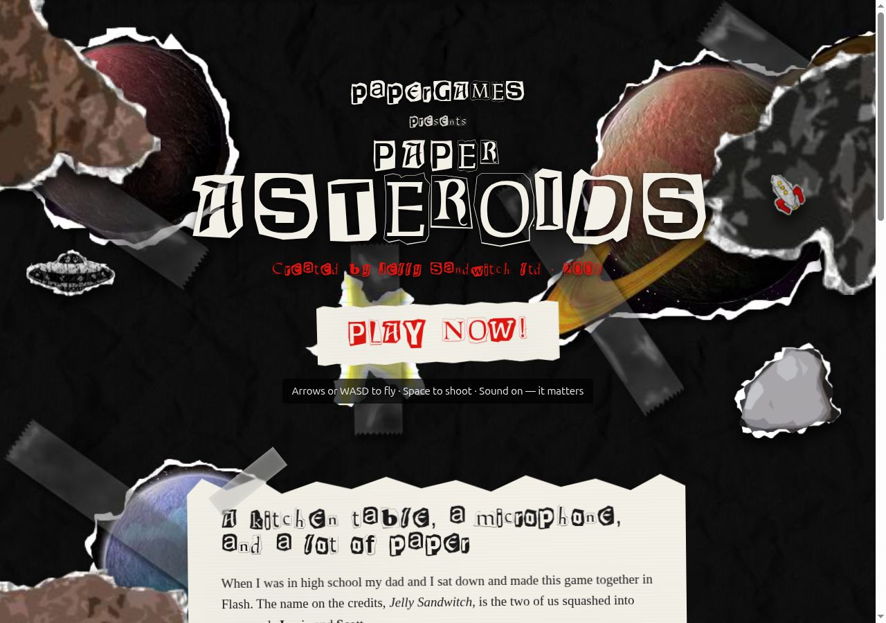
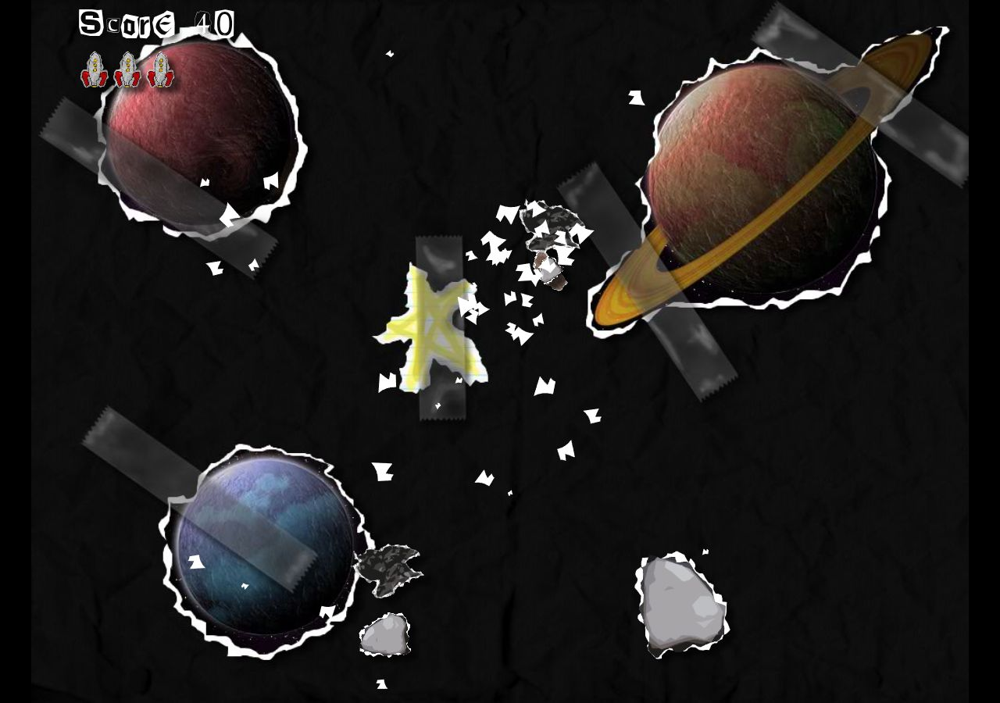

# Paper Asteroids

**Play it:** https://codingbutter.github.io/paper-asteroids/



In 2009 my dad, Scott, and I built an Asteroids clone in Flash. I was in high
school. We called ourselves Jelly Sandwitch ltd (Jamie + Scott, spelling
intentional). The whole thing is paper cutouts on a desk: a rocket, some
asteroids, a couple of UFOs, and a kid's imagination doing the rest.

Every sound in the game is one of us. The heartbeat that speeds up as the field
thins out is the two of us each saying "hum" into a microphone (`jamHum` and
`scoHum`). The rocket thrust is Dad going "shhhhh" for as long as he could; hold
the throttle long enough and you can hear him take a breath before it loops.
The lasers, explosions, UFO warbles and the paper rips are all mouth noises too.

Flash died, so in 2026 I decompiled the original `.fla`, ported the game to
TypeScript and Canvas, and built the dedication page around it. This repo is a
thank-you to my dad for the hours he spent teaching me to program, arguing with
me about how a rocket should turn, and letting a teenager drive.



## What's here

- `/` - the dedication page: the story, all ten sounds, the world scoreboard,
  and a paper rocket that chases your cursor and occasionally talks back.
- `/play/` - the game. Same tuning as the original: 45 Hz timestep, friction
  0.98, max speed 7.54, 6.5 degrees of rotation per tick.
- `original/` - the untouched 2009 `.swf` and `.fla`, for the archive.

## Controls

| Key            | Action              |
| -------------- | ------------------- |
| Left/Right, A/D | Rotate             |
| Up, W          | Thrust              |
| Space          | Fire                |
| P              | Pause (Q to quit)   |
| M              | Mute                |

## Development

```
pnpm install
pnpm dev        # http://localhost:5173
pnpm build      # typecheck + production build to dist/
```

## Leaderboard

High scores are global, stored in Postgres on Neon and served by a Neon
Function in `api/` (declared in `neon.ts`). Both the game and the landing page
read the endpoint from `VITE_SCORES_URL`; unset it for local-only scores.

```
neon link            # once, binds this checkout to the Neon project
neon deploy          # bundles api/index.ts and deploys the function
```

Deploys to GitHub Pages on every push to `main` (`.github/workflows/pages.yml`).

---

For Dad. Thanks for the shhhhh.
